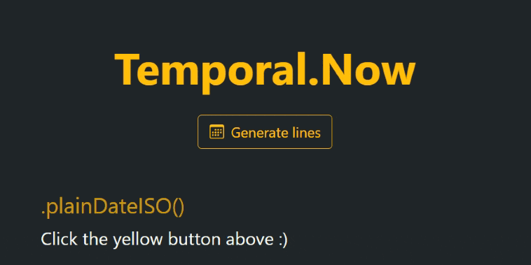

# Temporal.Now - The minimalist cheatsheet

## About

This is a kind of a simple and a sketchy "cheatsheet" for some basic Temporal API useful functionalities.
Notice that it is **NOT** meant to be helpful to everyone, especially when there already exists an official documentation for it.
This tiny project is just a way I found of practicing and understandind this new js feature, but feel free to take a look. 😀

## Take a look at it! 👀

Just [click me](https://temporal-now.netlify.app) to get to the Github Page of this repositories

